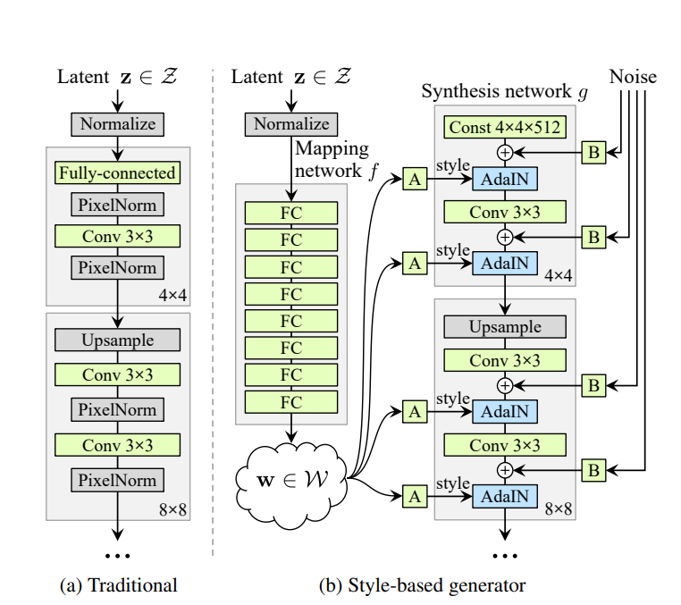
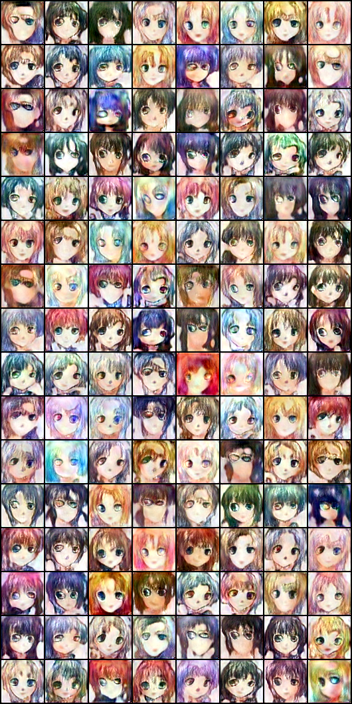

**STYLE GAN IMPLEMENTATION**

##FEATURES##
  1.Full implementation of the StyleGAN architecture.
  2.Supports custom datasets for training.
  3.Progressive growing of GAN layers to enable stable training on high-resolution images.
  4.Trained weights for 64 resolution.
  5.Tensorboard implementated for logging.

##Prerequisites##
Before you begin, ensure you have the following installed on your system:
    -Python 3.7+
    -PyTorch
    -NVIDIA CUDA (for GPU acceleration)
    -Required Python packages (see requirements.txt)

##HOW TO TRAIN##
1.Clone this repository 
2.Put dataset path in train.py file
3.Change Hyperparameters accordingly
4.Run the train.py file

##Results##

-These images are at 64*64 resolution trained locally, quality can be improved with more training

##TO DO##
- [x] Implementation (completed)
- [ ] Style-mixing and Style-Transfer(not completed)

